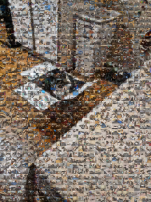
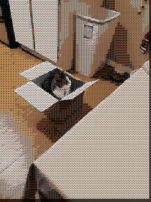

# Snakeskin

Snakeskin is a python cli tool for converting a target photo and an album of photos into beautiful mosaic representations of the target photo. I called it `snakeskin` because mosaic tiles look like scales to me, and the tool is written in python :snake:.

## Installation

`pip install .`

Note: Only tested on Ubuntu 22.04. See requirements_versions.txt for the known working versions of the packages.

## Usage

Minimum inputs:

`snakeskin ./path/to/input_image ./path/to/photos`

Maximum inputs:

`snakeskin ./path/to/input_image ./path/to/photos --method best --input_image_scale 1.0 --tile_scale 0.1 --alpha 0.3 --verbose False --show_lines False --output_directory ./path/to/output_directory`

This will create two photos.
- `mosaic.png` - the final mosaic image
- `side_by_side.png` - a side-by-side image comparing the final mosaic image to the original image

## Options

A variety of options are available. Note that for every approach, the final image is created via a weighted average of the original image and the raw mosaic. This can be configured via the `alpha` parameter (see `snakeskin --help`).

| Algorithm  | Mosaic Similarity  | Runtime  |
|---|---|---|
| `all`  |  Moderate - Low | High  |
| `best`  | High  |  Low |
| `quad`  | High  | Mid  |
| `superpixel`  | High  |  High |

The runtime is based on my experiences with my old laptop processing images from my phone (3024x4032). Your mileage may vary.
```
Intel i7-7500U CPU @ 2.170GHz
1 physical processor; 2 cores; 4 threads
16 Gb Memory
NVIDIA GeForce 940MX 2 Gb
```

Note that the time spent reading the images is not considered in the runtime analysis. Reading in an album of jpeg or png images takes a while if you have a large album. However, the library can optionally `pickle` the album (default behavior) to speed up successive mosaic generation for the same album. 

NOTE: In the interest of privacy, I resized the example images to pixelate the original images. But snakeskin can create very high resolution mosaics.

### All-inclusive Mosaic (`all`)

The defining characteristic of this option is that it will use all the images you give it (with some redundancy depending on the dimensions of your image). This is done by breaking the image into a regular grid of patches. Each patch is evaluated against the available mosaic images to construct a cost assignment matrix (where the cost is a weighted sum of the absolute RGB differences between image patches). Then a minimum linear sum assignment is solved to select which images are placed where in the mosaic. The cost matrix calculation is intensive and benefits from more cpu cores (via multiprocess.Pool).

Note that this method may not produce a mosaic that very closely represents the original image unless you choose a high alpha value for the weighted sum of the original image and raw mosaic. The mosaic similarity will vary depending on how similar your album photos are to the patches in your image, how many album photos you have, and how visually complex the original image is. This may not be the most popular method, but I find it conceptually satisfying to use all the images and still produce something similar-looking.



### Best-match Mosaic (`best`)

This mosaic algorithm also breaks the image into a uniform grid of patches. Each patch is then assigned the best matching mosaic image. This is accelerated through the use of the faiss library (inspired by: https://github.com/worldveil/photomosaic) which is able to support K nearest neighbor searches on absurdly large vectors (i.e. "best match" is based on a euclidean distance of image RGB values). Each image is represented as an vector by literally flattening the image and treating that as a feature vector. Initially, I experimented with using K-means, PCA, and neural network encoders to convert the images into a more compact vector representation, but using the flattened image worked really well and was actually faster with faiss (which I found very surpsing!). I think the main reason for this is that the small patches are not very meaningful to the neural networks. 

This approach benefits from a gpu since faiss benefits gpu acceleration but should be reasonably fast without one.



### Quadtree Mosaic (`quad`)

Unlike the first two algorithms, this one does not break the image into a uniform grid. Instead, it converts the imgae into a quadtree (i.e. the image is recursively subdivided into regions until a detail threshold is reached). After the quadtree is constructed, the patches are assigned mosaic images in the same way as the `Best-match Mosaic` method. The majority of the time spent for this algorithm is constructing the quadtree.

The quadtree I used was adapted from here: https://github.com/alpharaoh/Quadtree-Compression


### Superpixel Mosaic  (`superpixel`)

This method divides the image into regions using superpixel segmentation (https://docs.opencv.org/4.x/df/d6c/group__ximgproc__superpixel.html).
- For each superpixel region, the region is converted to a polygon
  - For each mosaic image, we resize the mosaic to fit the polygon and compare the mosaic pixels inside the polygon to the original image pixels inside the polyon.
  - The mosaic image that is most similar to the superpixel region is transfered to the mosaic image within the superpixel region.
In my opinion, this approach looks the most like an actual mosaic.


## TODO:
- [x] Mulithreaded file reading
- [x] Testing various input image sizes (so far I mostly tested 3024x4032 images)
- [ ] Better handling of method-specific parameters
- [ ] Less naive image database / caching
- [ ] More mosaic algorithms!
- [ ] Using shapes inside of the uniform grid mosaics (e.g. a circle with a black backround)
